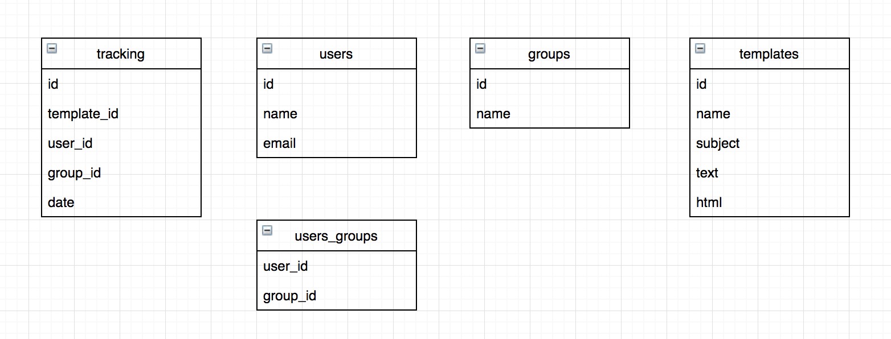

# Version Controlled Transactional Email

The system consists of:

- Mailer service: a node web server that exposes a REST API to send group emails.
- Tracker service: TODO: a node web server that exposes a REST API to track emails.
- Admin: a React app used to send test emails to selected groups.
- Analytics: TODO: A dashboard that renders stats for all emails sent and provides
  comparison tools to better evaluate the results of A/B testing and the performance of
  different email templates.

There's an assumed app, which is not part of this repo, which is the source of the actions that create messages in the queue that feeds the Mailer service.

## Design concepts

All systems are decoupled. This allows to manage and scale them independently.

Decoupling between the main app and the mailer is done by using a message queue in between.

## Folders

- `admin`: React admin tool.
- `mailer`: Mailer service.
- `tracker`: Tracker service (TODO).

## Database

In the proposal we use a non relational db (MongoDB for example) for a simpler design and
matching of programming data structures in the way they are consumed.

But, if a relational database must be implemented, it could look something like this:

## Challenge

Let’s build a transactional email service in a node web server that:

- 1. Sends Transactional Emails:
     Send emails to a group of users with an external API.
     We recommend Postmark, but you may use a different API if you feel strongly. For a
     database, feel free to mock the data/tables you will need with arrays and objects. We
     don’t expect you to spin up an ORM or write SQL in a db. We would like to
     see/discuss how you would design the tables you may need if you were using
     Postgres or another relational database.

- 2. Tracks Open and Click Rates:
     Using an external API such as Postmark, we would like
     you to track open rates and click rates on the emails that you send out. Give us an
     idea on how you would store and present these data. If using Postgres to capture
     this, what would the table schema look like?

- 3. Can track version of email templates:
     We would like for you to build some sort of
     version control system for the emails we send out. Postmark, for example, allows
     you to create a template for an email. When we edit the template on Postmark’s site,
     by default there is no version control system where we can track the edited version
     of the template with the original. We would like you to build a way to track the
     versions of the emails being sent out. That way, we can do serial A/B testing and
     track when an edit to our template makes a big difference in click rates. This is a
     feature that may require some creativity, because many email APIs don’t have this
     functionality out of the box.

## We’re expecting to see the following:

● A cool demo. You should clearly demonstrate all the above functionality to us over
Zoom.

● A proposed DB schema. Our backend uses a postgres db, and we’d like to see
how you’d modify its schema to track all the concepts in the above, for example what
users have received what emails, what postmark email templates map to different
email types, how we map open and link click events to email types etc.

● Clean code - We want to see you build this in a service oriented manner with the
Postmark API properly abstracted.

## Design proposal

